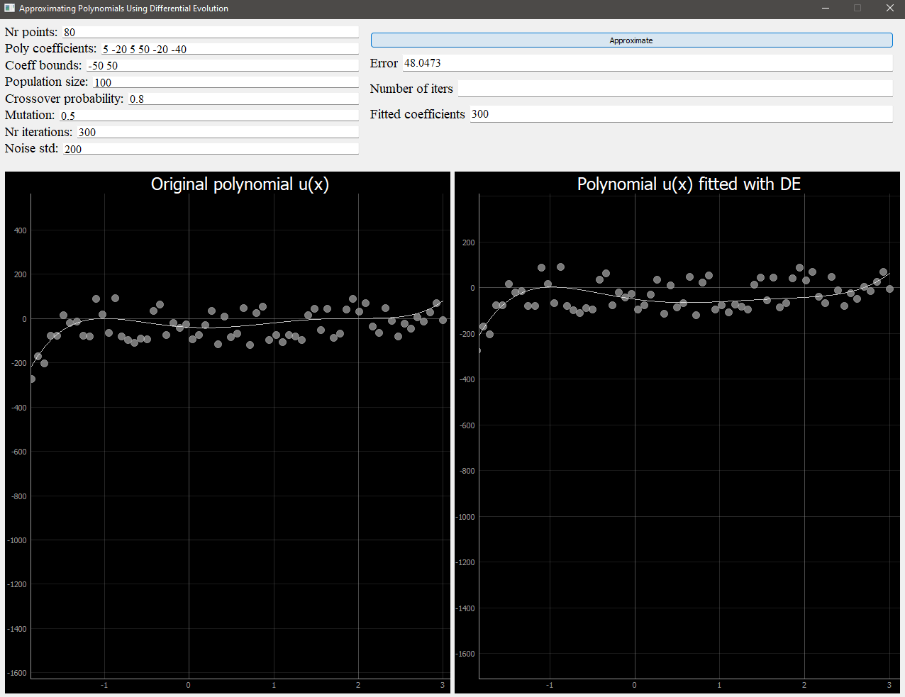

## Optimization for fitting the best curve using the differential evolution 
Using the data generator, we create a polynomial function and the data points based on this function. The task is to guess the polynomial coefficients using Differential Evolution and implementing the user friendly interface to play around with it.

